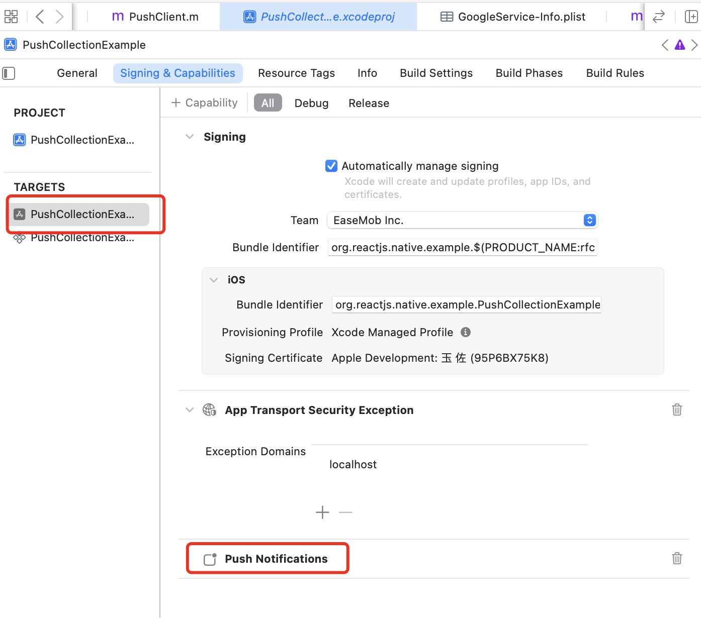

- [详细说明](#详细说明)
  - [快速集成](#快速集成)
    - [创建项目](#创建项目)
    - [ios 平台](#ios-平台)
      - [下载必要证书文件](#下载必要证书文件)
        - [apns](#apns)
        - [fcm](#fcm)
      - [配置工程](#配置工程)
        - [apns](#apns-1)
        - [fcm](#fcm-1)
      - [编写代码](#编写代码)
    - [android 平台](#android-平台)
      - [下载必要证书文件](#下载必要证书文件-1)
        - [fcm](#fcm-2)
        - [huawei](#huawei)
        - [honor](#honor)
        - [meizu](#meizu)
        - [oppo](#oppo)
        - [vivo](#vivo)
        - [xiaomi](#xiaomi)
      - [配置工程](#配置工程-1)
      - [编写代码](#编写代码-1)
  - [注意事项](#注意事项)
  - [添加厂商](#添加厂商)
  - [常见问题](#常见问题)
  - [参考资料](#参考资料)

# 详细说明

这个库是小米、华为、vivo、oppo、荣耀、魅族、apple、fcm 等推送的集合。主要负责获取推送 token 和接收离线推送的消息。

## 快速集成

主要操作步骤包括：

1. 创建项目（如果项目已经存在则跳过此步骤）
2. ios 平台（如果不需要 android 平台则跳过此步骤）：下载必要证书文件、配置工程、编写代码。
3. 配置 android 平台（如果不需要 android 平台则跳过此步骤）：下载必要证书文件、配置工程、编写代码。

### 创建项目

常见创建项目如下：

```sh
npx react-native@latest init --version 0.73.2 PushProjectDemo
```

添加依赖

```sh
yarn add react-native-push-collection
```

**注意** 假设 创建的项目名为 `PushProjectDemo`

### ios 平台

ios 平台，用户可以选择使用 apns 或者 fcm 之一。在初始化的时候指定选择，不支持动态切换。

调用 `ChatPushClient.init` 实现。

#### 下载必要证书文件

##### apns

不需要此步骤

##### fcm

下载文件 `GoogleService-Info.plist`, 放在 应用 app 的 ios 根部目录下。例如：`example/ios/PushProjectDemo/GoogleService-Info.plist`。

#### 配置工程

##### apns

不需要此步骤

##### fcm

需要手动将 `GoogleService-Info.plist` 添加到 应用 app 的 ios 工程中。
应用 app 需要添加推送能力。
在 `Info.plist`文件中，设置自动初始化设置为 false。

```xml
<plist version="1.0">
<dict>
	<key>FirebaseMessagingAutoInitEnabled</key>
	<false/>
</dict>
</plist>
```

修改应用的 `Podfile` 文件内容，添加如下内容：

```ruby
target 'PushProjectDemo' do
  # ...

  pod 'GoogleUtilities', :modular_headers => true
  pod 'FirebaseAuth', :modular_headers => true
  pod 'FirebaseCore', :modular_headers => true
  pod 'FirebaseMessaging', :modular_headers => true

  # ...
end
```




#### 编写代码

以 `objc` 版本为例。

在 `AppDelegate.mm` 中，添加如下代码。

添加头文件

```objc
#import <react-native-push-collection/PushClient.h>
```

在 `AppDelegate` 的 `- (BOOL)application:(UIApplication *)application didFinishLaunchingWithOptions:(nullable NSDictionary<UIApplicationLaunchOptionsKey, id> *)launchOptions` 中添加代码

```objc
[[PushClient sharedInstance] application:application didFinishLaunchingWithOptions:launchOptions];
```

在 `AppDelegate` 的 `- (void)application:(UIApplication *)application didRegisterForRemoteNotificationsWithDeviceToken:(NSData *)deviceToken` 中添加代码

```objc
[[PushClient sharedInstance] application:application didRegisterForRemoteNotificationsWithDeviceToken:deviceToken];
```

在 `AppDelegate` 的 `- (void)application:(UIApplication *)application didFailToRegisterForRemoteNotificationsWithError:(NSError *)error;` 中添加代码

```objc
[[PushClient sharedInstance] application:application didFailToRegisterForRemoteNotificationsWithError:error];
```

在 `AppDelegate` 的 `- (void)application:(UIApplication *)application didReceiveRemoteNotification:(NSDictionary *)userInfo fetchCompletionHandler:(void (^)(UIBackgroundFetchResult result))completionHandler` 中添加代码

```objc
[[PushClient sharedInstance] application:application didReceiveRemoteNotification:userInfo fetchCompletionHandler:completionHandler];
```

### android 平台

android 平台，用户可以选择 手机厂商 或者 fcm 之一。不支持动态切换。

**注意** 手机厂商目前仅支持 华为、honor、魅族、oppo、vivo、小米。其它厂商如果需要的话，可以在此仓库提交 pr 请求。

#### 下载必要证书文件

##### fcm

下载文件 `google-services.json`，放在 应用 app 的 android 根目录下，例如： `example/android/app/google-services.json`。

##### huawei

下载文件 `agconnect-services.json`，放在 应用 app 的 android 根目录下，例如： `example/android/app/agconnect-services.json`。

##### honor

下载文件 `mcs-services.json`，放在 应用 app 的 android 根目录下，例如： `example/android/app/mcs-services.json`。

##### meizu

##### oppo

##### vivo

##### xiaomi

#### 配置工程

在 项目级别的 `build.gradle` 配置文件中。

```groove
buildscript {
    // ...
    repositories {
        // ...
        google()
        mavenCentral()
      maven { url 'https://developer.hihonor.com/repo' }
      maven { url 'https://developer.huawei.com/repo/' }
    }
    dependencies {
        // ...
        classpath("com.android.tools.build:gradle:7.3.1")
        classpath("com.facebook.react:react-native-gradle-plugin")

      // fcm config
      // NOTE: if you are on react-native 0.71 or below, you must not update
      //       the google-services plugin past version 4.3.15 as it requires gradle >= 7.3.0
      classpath 'com.google.gms:google-services:4.3.15'

      // honor config
      // 增加asplugin插件配置，推荐您使用最新版本。
      classpath 'com.hihonor.mcs:asplugin:2.0.1.300'

      // huawei config
      // 增加AGC插件配置，请您参见AGC插件依赖关系选择合适的AGC插件版本。
      classpath 'com.huawei.agconnect:agcp:1.9.1.301'
    }
}

allprojects {
  repositories {
    // ...
    google()
    mavenCentral()
    maven { url 'https://developer.hihonor.com/repo' }
    maven { url 'https://developer.huawei.com/repo/' }
  }
}

```

配置 应用的 `build.gradle`

```groove
// 添加到顶部
apply plugin: "com.android.application"
apply plugin: "com.facebook.react"

// fcm config
apply plugin: 'com.google.gms.google-services'

// honor config
apply plugin: 'com.hihonor.mcs.asplugin'

// huawei config
apply plugin: 'com.huawei.agconnect'
```

配置 各个厂商需要的必要参数，放在 `local.properties` 文件中。

```
# ...
MEIZU_PUSH_APPKEY=xxx
MEIZU_PUSH_APPID=xxx
OPPO_PUSH_APPID=xxx
OPPO_PUSH_APPKEY=xxx
OPPO_PUSH_APPSECRET=xxx
VIVO_PUSH_APPID=xxx
VIVO_PUSH_APPKEY=xxx
MI_PUSH_APPKEY=xxx
MI_PUSH_APPID=xxx
FCM_SENDERID=xxx
HONOR_PUSH_APPID=xxx
HUAWEI_PUSH_APPID=xxx
```

**注意** 配置会在同步项目的时候生成对应文件，完成静态配置。

#### 编写代码

在 `MainApplication` 文件中，在方法 `onCreate`中添加如下代码：

```java
registerActivityLifecycleCallbacks(new PushActivityLifecycleCallbacks());
```

**注意** `MainApplication` 为入口文件。

```xml
  <application
      android:name=".MainApplication">
  </application>
```

## 注意事项

1. 该 npm 不能和 `@react-native-firebase/messaging` 共同使用。如果需要使用则请不要使用该库。
2. 国内用户如果需要使用 `fcm`，可能需要正常访问外网。
3. ios 平台，如果使用 `apns`，返回的 `token` 是经过 `base64` 编码的字符串，如果传给原生，需要 `base64` 解码操作。
4. ios 平台，使用了`[UNUserNotificationCenter currentNotificationCenter].delegate = self;`，可能导致用户无法使用该代理接收通知。

## 添加厂商

[详见这里](./add_manufacturer.md)

## 常见问题

[常见问题](./qa.md)

## 参考资料

[详见这里](./ref.md)
