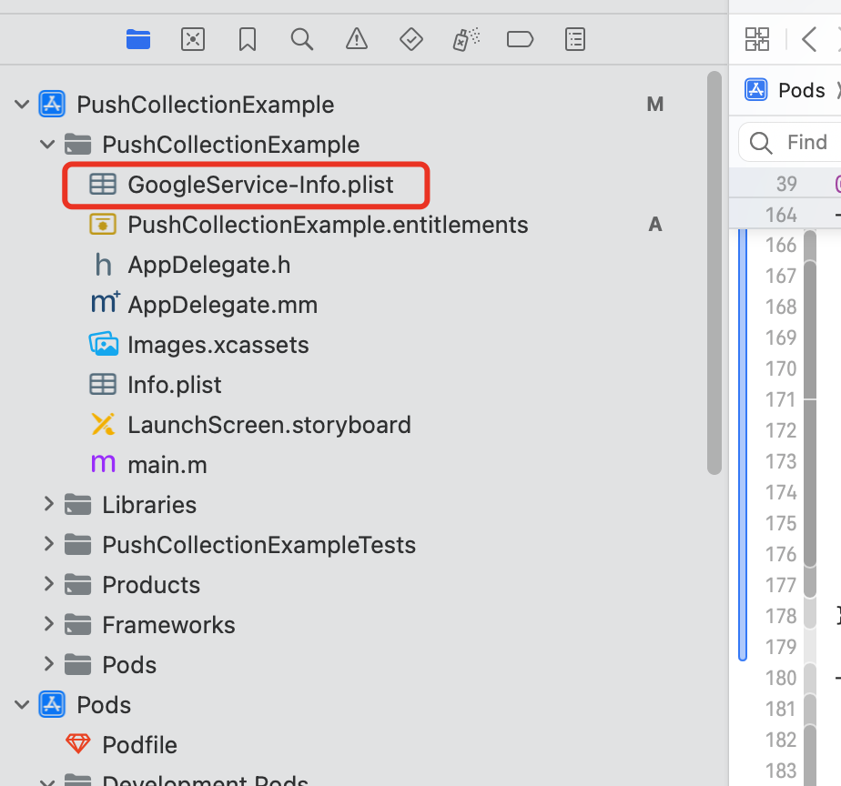
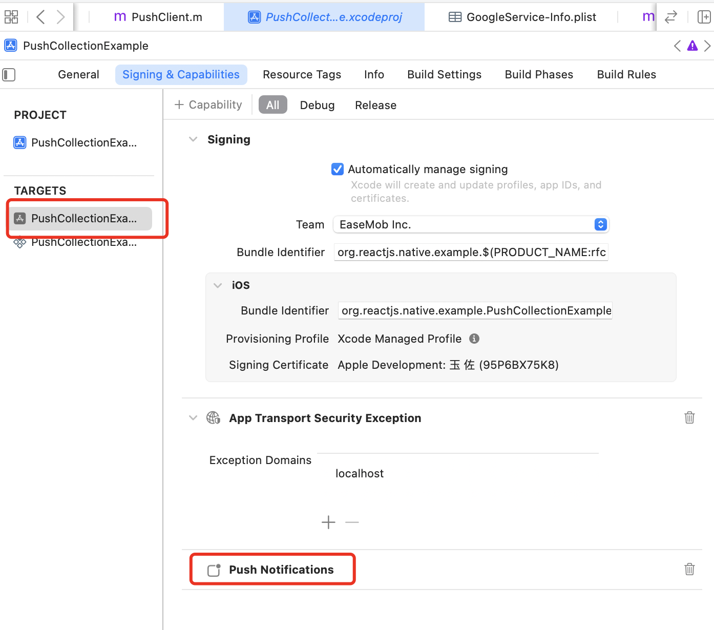

- [Detailed description](#detailed-description)
  - [Quick integration](#quick-integration)
    - [Create a project](#create-a-project)
    - [ios platform](#ios-platform)
      - [Download necessary certificate files](#download-necessary-certificate-files)
        - [apns](#apns)
        - [fcm](#fcm)
      - [Configure the project](#configure-the-project)
        - [apns](#apns-1)
        - [fcm](#fcm-1)
      - [Write native code (ios)](#write-native-code-ios)
    - [android platform](#android-platform)
      - [Download necessary certificate files](#download-necessary-certificate-files-1)
        - [fcm](#fcm-2)
        - [huawei](#huawei)
        - [honor](#honor)
        - [meizu](#meizu)
        - [oppo](#oppo)
        - [vivo](#vivo)
        - [xiaomi](#xiaomi)
      - [Configure the project](#configure-the-project-1)
      - [Write native code (android)](#write-native-code-android)
    - [write quick start code (typescript)](#write-quick-start-code-typescript)
  - [Notes](#notes)
  - [Add manufacturers](#add-manufacturers)
  - [FAQ](#faq)
  - [References](#references)

# Detailed description

This library is a collection of push notifications from Xiaomi, Huawei, vivo, oppo, Honor, Meizu, apple, fcm, etc. It is mainly responsible for obtaining push tokens and receiving offline push notifications.

## Quick integration

The main steps include:

1. Create a project (skip this step if the project already exists)

2. iOS platform (skip this step if the Android platform is not required): download necessary certificate files, configure the project, and write code.

3. Configure the Android platform (skip this step if the Android platform is not required): download necessary certificate files, configure the project, and write code.

### Create a project

Common project creation is as follows:

```sh
# Specify common version numbers to reduce storage and unknown issues.
npx react-native@latest init --version 0.73.2 PushProjectDemo
```

Add dependencies

```sh
yarn add react-native-push-collection
```

**Note** Assume that the created project is named `PushProjectDemo`

### ios platform

On ios platform, users can choose to use either apns or fcm. The choice is specified during initialization, and dynamic switching is not supported.

Call `ChatPushClient.init` to implement it.

#### Download necessary certificate files

##### apns

This step is not required

##### fcm

Download the file `GoogleService-Info.plist` and put it in the ios root directory of the application app. For example: `example/ios/PushProjectDemo/GoogleService-Info.plist`.

#### Configure the project

##### apns

This step is not required

##### fcm

You need to manually add `GoogleService-Info.plist` to the ios project of the application app.
The application app needs to add push capabilities.
In the `Info.plist` file, set the automatic initialization setting to false.

```xml
<plist version="1.0">
<dict>
<key>FirebaseMessagingAutoInitEnabled</key>
<false/>
</dict>
</plist>
```

Modify the content of the application's `Podfile` file and add the following content:

```ruby
target 'PushProjectDemo' do
# ...

  pod 'GoogleUtilities', :modular_headers => true
  pod 'FirebaseAuth', '>=10.0.0', :modular_headers => true
  pod 'FirebaseCore', '>=10.0.0', :modular_headers => true
  pod 'FirebaseMessaging', '>=10.0.0', :modular_headers => true

# ...
end
```




#### Write native code (ios)

Here is the translation of your provided instructions into English:

Using the `objc` version as an example.

In `AppDelegate.mm`, add the following code.

Add the header file:

```objc
#import <react-native-push-collection/PushClient.h>
```

In the `- (BOOL)application:(UIApplication *)application didFinishLaunchingWithOptions:(nullable NSDictionary<UIApplicationLaunchOptionsKey, id> *)launchOptions` method of `AppDelegate`, add the code:

```objc
[[PushClient sharedInstance] application:application didFinishLaunchingWithOptions:launchOptions];
```

**The following code implementation is optional, if not implemented, there is a default call internally.**

In the `- (void)application:(UIApplication *)application didRegisterForRemoteNotificationsWithDeviceToken:(NSData *)deviceToken` method of `AppDelegate`, add the code:

```objc
[[PushClient sharedInstance] application:application didRegisterForRemoteNotificationsWithDeviceToken:deviceToken];
```

In the `- (void)application:(UIApplication *)application didFailToRegisterForRemoteNotificationsWithError:(NSError *)error` method of `AppDelegate`, add the code:\*\*\*\*

```objc
[[PushClient sharedInstance] application:application didFailToRegisterForRemoteNotificationsWithError:error];
```

In the `- (void)application:(UIApplication *)application didReceiveRemoteNotification:(NSDictionary *)userInfo fetchCompletionHandler:(void (^)(UIBackgroundFetchResult result))completionHandler` method of `AppDelegate`, add the code:

```objc
[[PushClient sharedInstance] application:application didReceiveRemoteNotification:userInfo fetchCompletionHandler:completionHandler];
```

### android platform

On the android platform, users can choose one of the mobile phone manufacturers or fcm. Dynamic switching is not supported.

**Note** Currently, only Huawei, honor, Meizu, oppo, vivo, and Xiaomi are supported mobile phone manufacturers. If other manufacturers need it, they can submit pr requests in this repository.

#### Download necessary certificate files

##### fcm

Download the file `google-services.json` and put it in the android root directory of the application app, for example: `example/android/app/google-services.json`.

##### huawei

Download the file `agconnect-services.json` and put it in the android root directory of the application app, for example: `example/android/app/agconnect-services.json`.

##### honor

Download the file `mcs-services.json` and put it in the android root directory of the application app, for example: `example/android/app/mcs-services.json`.

##### meizu

##### oppo

##### vivo

##### xiaomi

#### Configure the project

Here is the translation of your provided Gradle configuration instructions into English:

In the project-level `build.gradle` configuration file:

```groovy
buildscript {
    // ...
    repositories {
        // ...
        google()
        mavenCentral()
        maven { url 'https://developer.hihonor.com/repo' }
        maven { url 'https://developer.huawei.com/repo/' }
    }
    dependencies {
        // ...
        classpath("com.android.tools.build:gradle:7.3.1")
        classpath("com.facebook.react:react-native-gradle-plugin")

        // FCM config
        // NOTE: if you are on React Native 0.71 or below, do not update
        //       the Google Services plugin past version 4.3.15 as it requires Gradle >= 7.3.0
        classpath 'com.google.gms:google-services:4.3.15'

        // Honor config
        // Add the asplugin configuration. It is recommended to use the latest version.
        classpath 'com.hihonor.mcs:asplugin:2.0.1.300'

        // Huawei config
        // Add the AGC plugin configuration. Please refer to the AGC plugin dependency relationship to select the appropriate AGC plugin version.
        classpath 'com.huawei.agconnect:agcp:1.9.1.301'
    }
}

allprojects {
    repositories {
        // ...
        google()
        mavenCentral()
        maven { url 'https://developer.hihonor.com/repo' }
        maven { url 'https://developer.huawei.com/repo/' }
    }
}
```

Configure the application's `build.gradle`:

```groovy
// Add to the top
apply plugin: "com.android.application"
apply plugin: "com.facebook.react"

// FCM config
apply plugin: 'com.google.gms.google-services'

// Honor config
apply plugin: 'com.hihonor.mcs.asplugin'

// Huawei config
apply plugin: 'com.huawei.agconnect'
```

Configure the necessary parameters for each manufacturer and place them in the `local.properties` file:

```
# ...
MEIZU_PUSH_APPKEY=xxx
MEIZU_PUSH_APPID=xxx
OPPO_PUSH_APPID=xxx
OPPO_PUSH_APPKEY=xxx
OPPO_PUSH_APPSECRET=xxx
VIVO_PUSH_APPID=xxx
VIVO_PUSH_APPKEY=xxx
MI_PUSH_APPKEY=xxx
MI_PUSH_APPID=xxx
FCM_SENDERID=xxx
HONOR_PUSH_APPID=xxx
HUAWEI_PUSH_APPID=xxx
```

**Note** The configuration will generate the corresponding file when synchronizing the project to complete the static configuration.

#### Write native code (android)

In the `MainApplication` file, add the following code in the method `onCreate`:

```java
registerActivityLifecycleCallbacks(new PushActivityLifecycleCallbacks());
```

**Note** `MainApplication` is the entry file.

```xml
<application
    android:name=".MainApplication">
</application>
```

### write quick start code (typescript)

```tsx
import * as React from 'react';

import { View, Text, Pressable, ToastAndroid } from 'react-native';
import {
  ChatPushClient,
  getPlatform,
  getDeviceType,
  type PushType,
  type ChatPushListener,
} from 'react-native-push-collection';

export default function App() {
  const [result, setResult] = React.useState<number | undefined>();

  const init = React.useCallback(() => {
    // todo: Get the current device platform `ios` or `android`
    const platform = getPlatform();
    let pushType: PushType;
    if (platform === 'ios') {
      // todo: Can be set to `fcm` or `apns`
      pushType = 'fcm';
    } else {
      // todo: Automatically get the current type through the `getDeviceType()` method. See source code for details.
      pushType = (getDeviceType() ?? 'unknown') as PushType;
    }
    // todo: 1. init
    ChatPushClient.getInstance()
      .init({
        platform: getPlatform(),
        pushType: pushType as any,
      })
      .then(() => {
        // todo: 2. add listener
        ChatPushClient.getInstance().addListener({
          onError: (error) => {
            ToastAndroid.show(
              'onError' + JSON.stringify(error),
              ToastAndroid.SHORT
            );
          },
          onReceivePushToken: (token) => {
            ToastAndroid.show('onReceivePushToken' + token, ToastAndroid.SHORT);
          },
        } as ChatPushListener);
      })
      .catch((e) => {
        ToastAndroid.show('init error:' + e.toString(), ToastAndroid.SHORT);
      });
  }, []);

  const uninit = React.useCallback(() => {
    ChatPushClient.getInstance().clearListener();
  }, []);

  const onGetTokenAsync = () => {
    // todo: 3. get token with `onReceivePushToken`
    ChatPushClient.getInstance()
      .getTokenAsync()
      .then(() => {
        ToastAndroid.show('get token success', ToastAndroid.SHORT);
      })
      .catch((e) => {
        ToastAndroid.show(
          'get token error:' + e.toString(),
          ToastAndroid.SHORT
        );
      });
  };

  React.useEffect(() => {
    init();
    return () => {
      uninit();
    };
  }, [init, uninit]);

  return (
    <View>
      <Text>Result: {result}</Text>
      <Pressable onPress={onGetTokenAsync}>
        <Text>{'get token async'}</Text>
      </Pressable>
    </View>
  );
}
```

[full code source](https://github.com/AsteriskZuo/react-native-push-collection/blob/main/example/src/App.tsx)

## Notes

1. This npm cannot be used together with `@react-native-firebase/messaging`. If you need to use it, please do not use this library.

2. If domestic users need to use `fcm`, they may need to access the Internet normally.

3. On the ios platform, if `apns` is used, the returned `token` is a string encoded by `base64`. If it is passed to the native, `base64` decoding operation is required.

4. On the ios platform, `[UNUserNotificationCenter currentNotificationCenter].delegate = self;` is used, which may cause users to be unable to use the agent to receive notifications.

## Add manufacturers

[See here](./add_manufacturer.en.md)

## FAQ

[FAQ](./qa.en.md)

## References

[See here](./ref.en.md)
